# Quizprep - about the page
Welcome to Quizprep. A page that tests your knowledge on three of the most sought after fantasy TV shows and movies. In the long term this could be a community lead page where quizzes on all types of subjects can be shared and played, but to start, the focus lies on the Witcher series, the Lord of the Rings movies (The early 2000 ones still win it for me!) and the Game of Thrones series (might skip the final episodes). The website allows you to play all three and tracks your score as you do it, hopefully helping you learn a few interesting facts on the shows. It also has a contact page through which feedback can be shared, bugs can be reported and new quiz ideas can be shared.

The website has been written with the concept of "mobile first" in mind. Expecting users to mostly enjoy the quizzes 'on the go' or as a quick pass time during the day. The thought process has also been to first complete the functionality (JS) of Quickprep and build the website around that functionality.

## Business goals
- get users excited about quizzes
- be easy to use and easy to come back to
- mobile focused design for a quick and on the go quiz action
- help users prepare for quiznight (etc.) or use Quizprep for this
- become a collective of quizzes on a large number of topics
- (long term) create a community that is excited about sharing and playing quizzes
- (optional) to make Quizprep profitable, the side bars on each side of the screen could contain advertisements (on mobile this could be added at the bottom of the page or in between quizzes)

## User goals
- enjoy a fun quiz (or two)
- quick, easy pass time activity
- learn something new about your favourite shows (long term: a variety of topics)
- (long term) be an active member of a quiz community with similar interests
- (long term) play new quizzes every week

# UX experience
As one of the main uses of Quizprep is aimed at quick and easy 'quizzing', the user experience of the pages is focused on the mobile device. Quizprep can absolutely be played on larger devices (and is adapted for it) but the clean layout, purposefully limited details and options, make that a user can get to their favourite quiz experience as soon as with a single click. The layout is adapted for each quiz, to also 'set the right scene' when starting ones quiz fun.

The homepage consists of:
- a brief introduction
- a clear button that lists all available quizzes, an 'advertised' quiz (could be a new, updated or in the long term, a sponsored quiz)
- a short description of what Quizprep is
- and a few suggested quizzes

The quizpages themselves 'set the scene' through the use of images of the show in the background. Unique and relevant pictures are added for each question and users know instantly when their answer is correct or not through an added colorcoding on the border of the quiz area. Correct and wrong answers are also counted which provides the user a final result at the end of the quiz, stating how many questions were answered correctly and how many were answered incorrectly.

A simple contact page is also available to provide feedback and/or to connect with the creators of Quizprep.

# User stories
In the short term the main user story would be someone looking to play a fun quiz on their favourite movie/series and finds this on one of the search engines. This could be through the home page or even directly on the quiz itself.

Main use for Quizprep would be for quick quiz fun. It is not expected that users will spend more then 10 minutes on the page depending on if they have found already the quiz they want to play. Target group would be anyone with 5 minutes to spare, when and wherever they are. The enjoyment comes from the quick excitement around the quiz topic and eventually the knowledge that Quizprep would be able to provide these quick spells of entertainment in the future through the multitude of quizzes that would be added.

In the long term, a quiz community could be created. Which would get the users coming back on a regular basis. To either play new quizzes or be a part of the quiz creator group. Creating/Suggesting quizzes that get the most users.

# Mobile users
Quizprep was created with a 'mobile first' mindset, before reviewing the websites funcitionality for tablets/desktops. Expecting the main userbase to arrive on the page through their mobile devices. The layout therefor is simple but efficient and pages were created mostly with the 'Samsung Galaxy S20 Ultra' as the test device. From there it has been adapted for larger (and smaller) screens and tested through a Macbook with a 16 inch screen.

Reasoning is two fold:
A - Mobile as a device is used in a much higher frequency then tablets or desktops/laptops
B - Quizprep aimes for quick and often 'on the go' users. Expected therefor is as well that specifically the Quizprep userbase would mostly visit through their mobile device

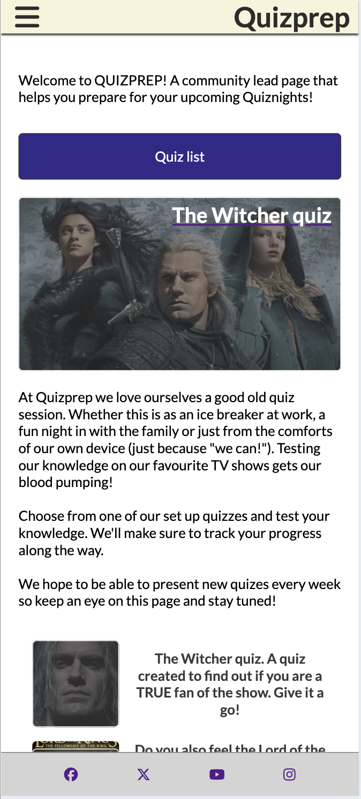
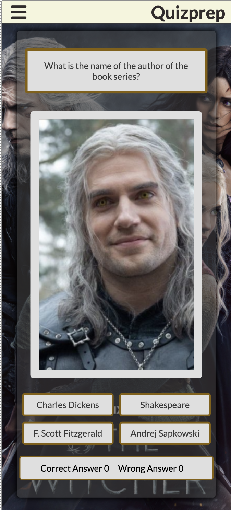

# Wireframes
For the wireframes I used the Balsamiq app. First writing out the concept of Quizprep (what is it and what could it be in the future?). After which I wrote out the steps that needed to be taken to successfully create the website, followed by several page designs for the homepage and the quizpages (trying to find specifically the best/fun usage on a mobile device). As research shows that 85% (or some say more) of people is right handed, the current design was chosen to initially tailor to the masses (e.g. the 'Next' button is on the right of the page).

The approach when designing the pages overall was to first implement the functionality of the quiz and tailor the quiz pages around that. The thought proces was to make sure that the quizzes themselves would be comfortable to play by the users, aiming for minimal 'oddities' that could spoil the users fun. Ones that was functional, the rest of Quizprep was build around it

General wirefame overview
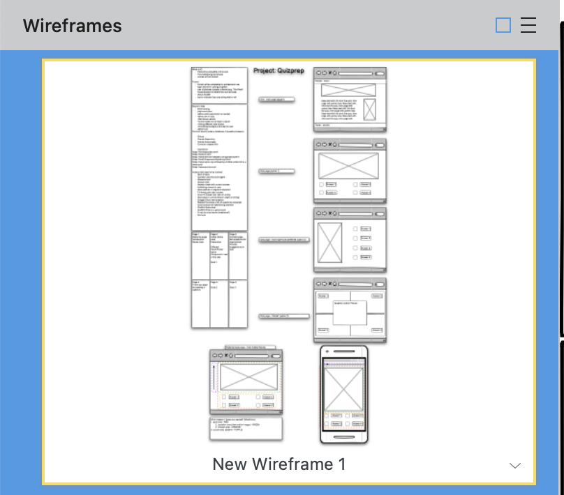

All Wireframes
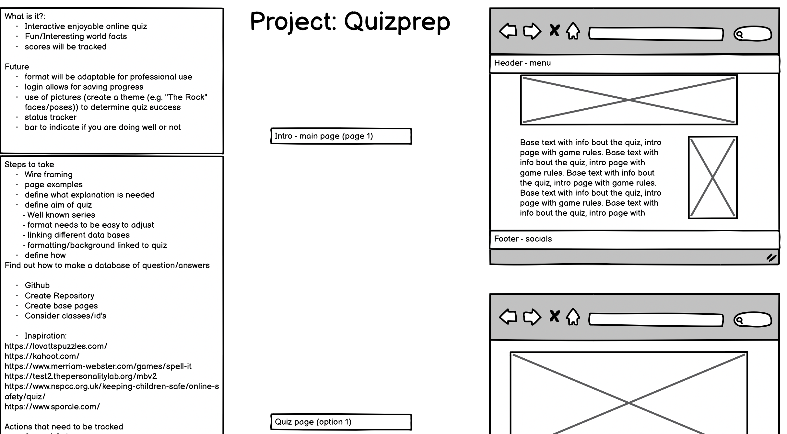
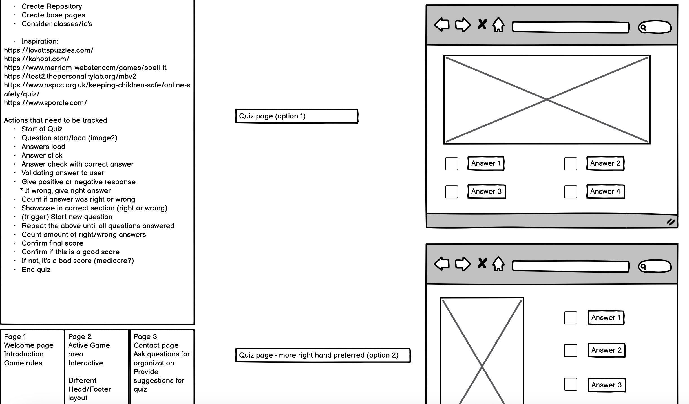
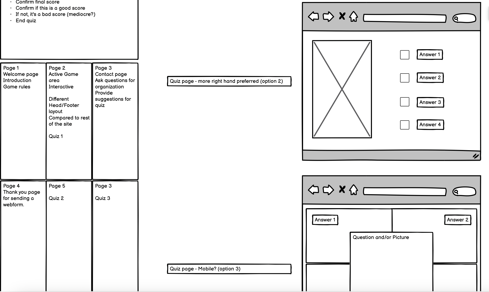
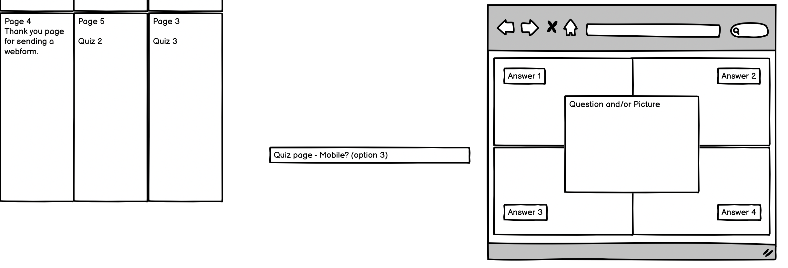

When the base was set, I wrote out which steps the quizzes would need to take in Javascript (before attempting to code). Trying to find the logic behind the tool and what it would need to do/track, before even showing the first question.

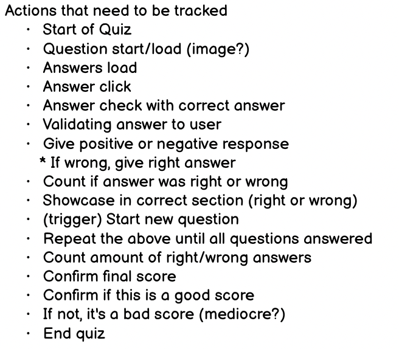

There are evidently a few differences between my original wireframe and the end result (e.g. having a slider present on the screen, showcasing the users overall score). This in favour of my current Javascript knowledge. However this does allow for future adaptations to include some of these features

System (HTML/CS/JS) logic
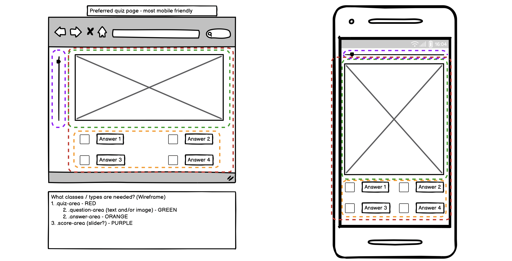

# Features

## NAV bar
The navigation bar is adaptable for smaller and larger screens. Making use of the "hamburger" menu for mobile and adding the homepage/contact links written out at the top of the page for larger devices. It still allows space for more menu options. Currently the different quizzes are also added for easy navigation while working on the site. However with the 'hidden class' added, they are only visible when desired, not for the users.

NAV bar for larger devices 

NAV bar closed and open for mobilie devices 
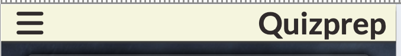
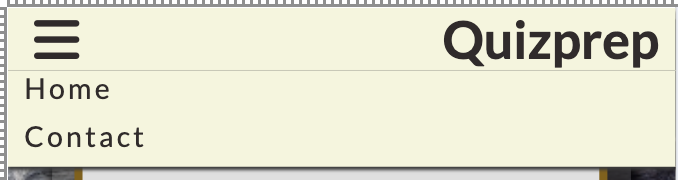

NAV bar Gitpod code with hidden menu
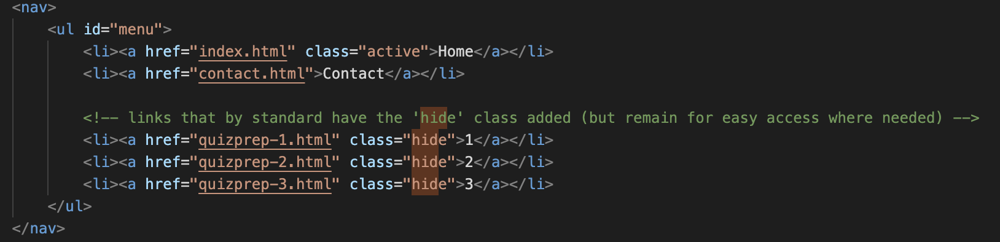

## Quizlist
An easy to spot and use dropdown button that is used as the main quiz portal. This Quizlist is the main function that a user can use to browse through the available quizzes. In future iterations the list could be added in a menu and/or a side bar but to keep with the easy overview, this button is the only function that lists all quizzes. It shows as a button when scrolling, but only when hovered over or clicked on it will display the quizlist. This to improve general site use and access. The button is a distinct different color from the rest of the page to make sure that it stands out.

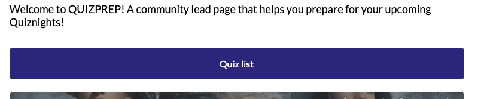

## 'Advertised' Quiz
To allow for a 'one click' quiz access, the 'advertised quiz' section was added to the home page. This is currently the main quiz available but towards the future this could be used for adding new quizzes, sponsored quizzes or if preferences of users are known, suggested quizzes that match the users preferences thus far.

Added over the image is the title of the quiz to clarify the quiz subject.

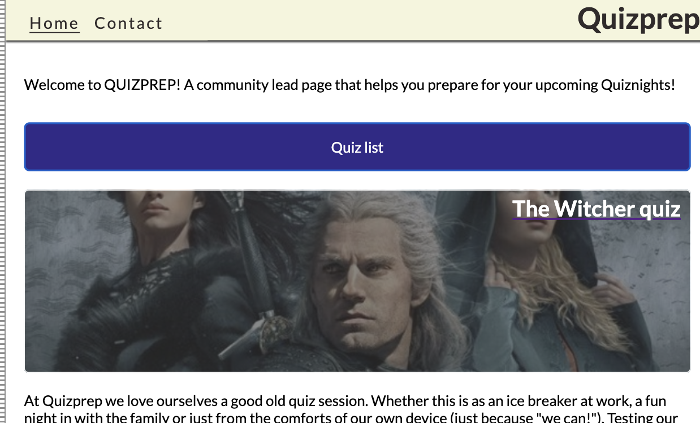

## Quiz suggestions
Similar to the 'Advertised' quiz section, it allows a 'one click' access to some of the available quizzes. It can be added with a small image + a short description of the quizzes mentioned in this short overview. Especially when the amount of available quizzes increases, this section is interesting for the user if it shows quizzes that align with their preferences. Also for users that enjoy reading a short description of a quiz, this section can tailor to those (as not all users would only be image/visual driven). 

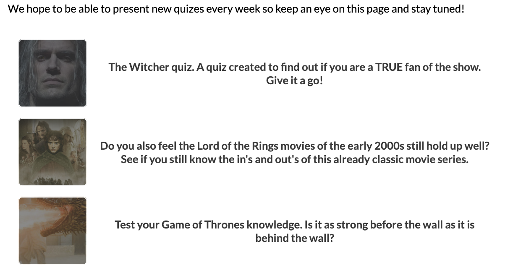

## Contact and Feedback page
If there is any feedback on the quizzes, users can reach out to the creators of Quickprep. In the longterm this page will also be the first (simple) foundation of the community through which users can give suggestions for quizzes to come. The page is kept simple again to highlight the use and to make it easily accessable via mobile devices.

## Visuals/Images adapted to the relevant quiz
To help users 'get in the zone' each quiz has its own base page, so that imaging around the quiz can be formatted in line with the quiz subject. Helping users get a look and feel of the quiz subject (currently, one of the three shows) while playing the quiz. The images are also adapted to the screensizes for optimal use.

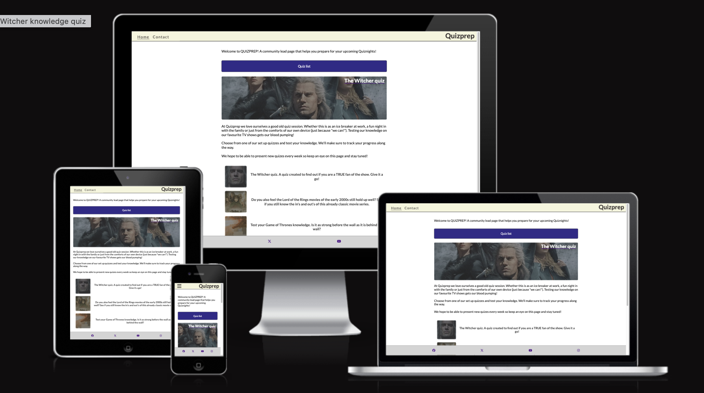

## (Re)Start button 
The start button allows the quiz to be kicked off (it is also the trigger for Javascript to launch the correct questions and visuals). It is only visible at the start of the quiz and at the end of the quiz. Where however the Start button will be 'rebranded' to "Restart" as it will allow the user to redo the quiz if they are hoping to get a better score. 

(Future iterations could also include a cap on the amount of questions answered and restarting the quiz would then load a new set of questions/answers on the topic)

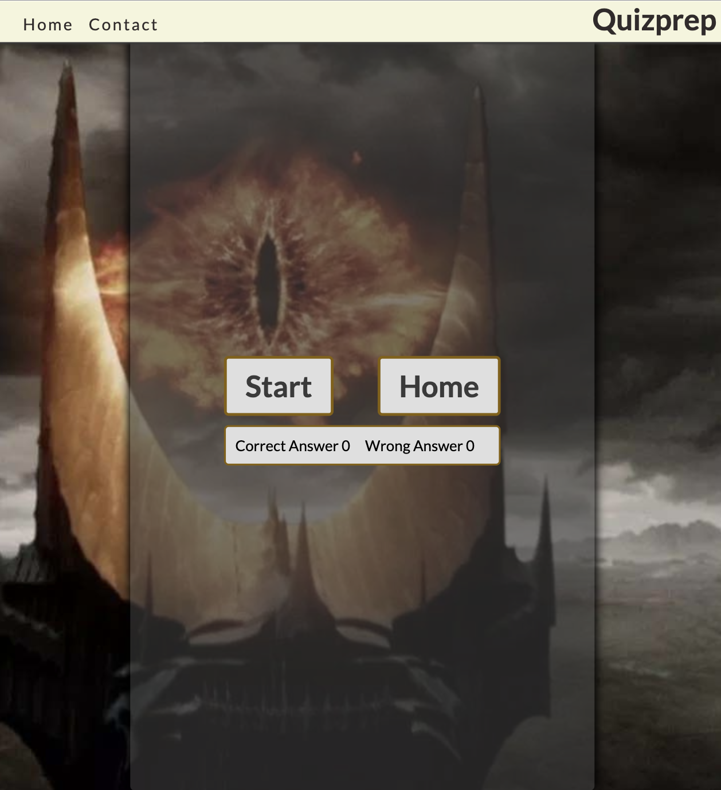
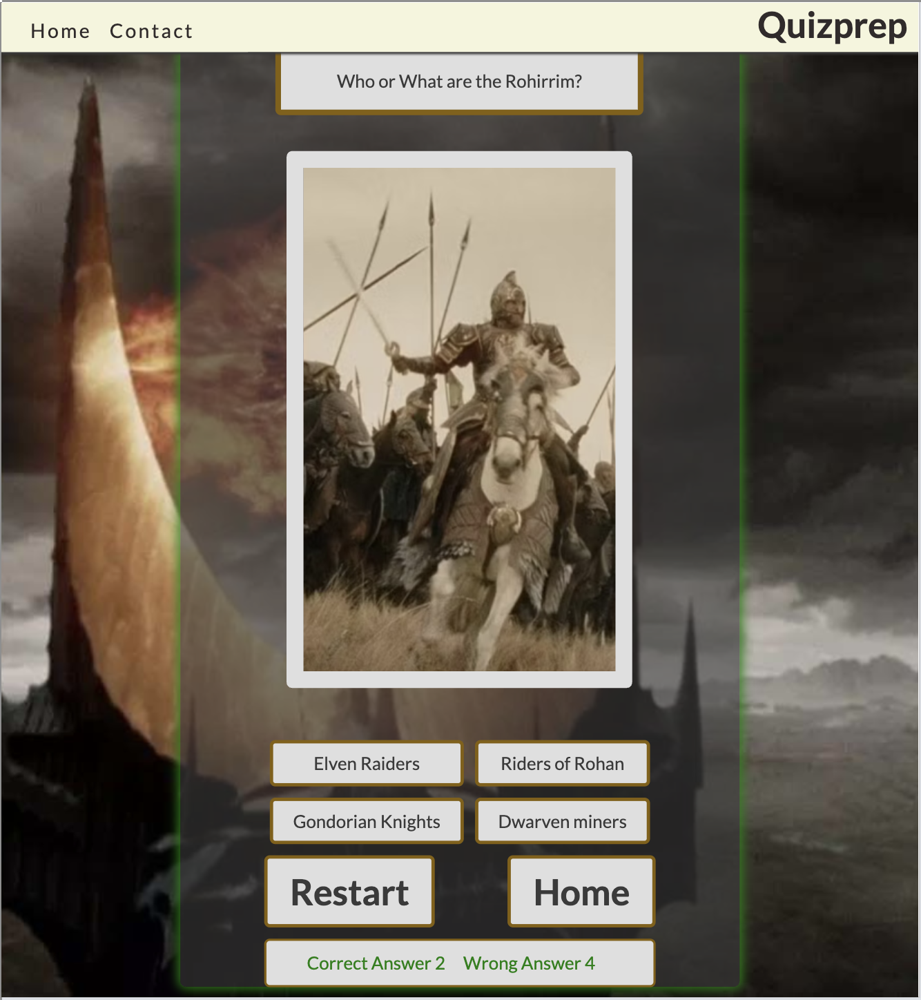

## Next button
The Next button only shows when an answer is given. This to trigger that the user always provides an answer and is unable to simply click through a quiz.

(* See screenshots added above for reference *)

## Correct/Incorrect visualisation
As part of the experience, the frame surrounding the question and answer area will light up green or red, depending on the answer that the users gives is correct (green) or wrong (red). As quizzes are all about giving a 'high' when a correct answer is given this will help with the quiz experience.

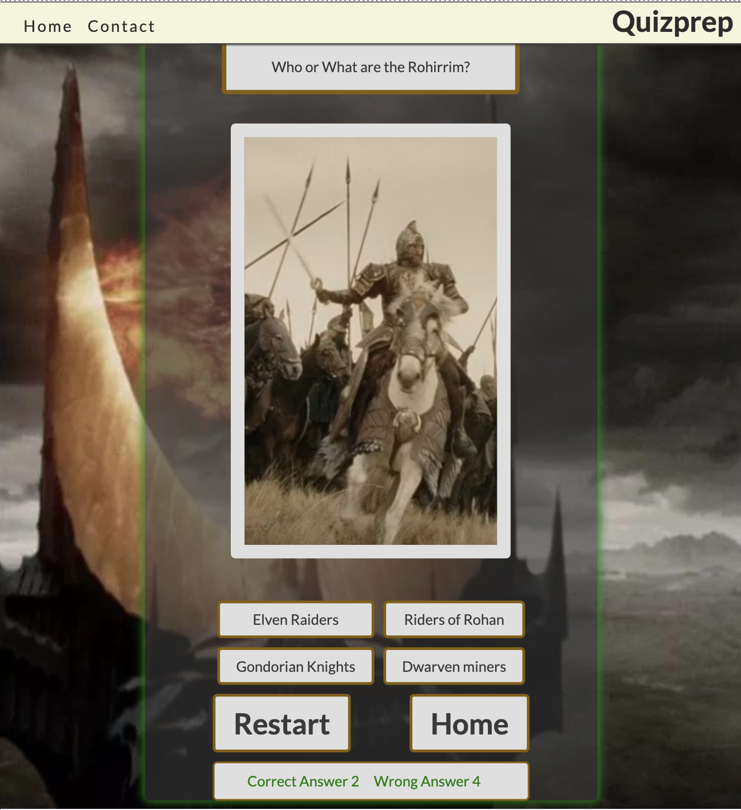
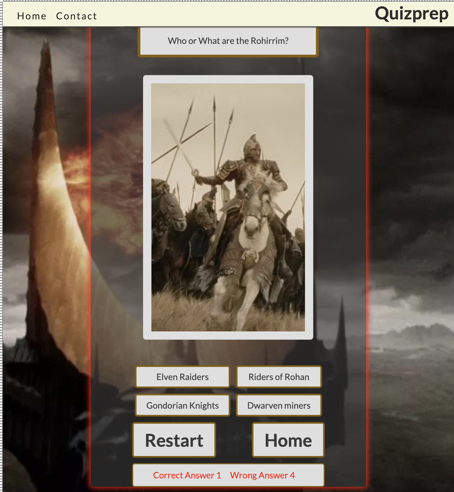

## Score tracking
At the bottom of the quiz pages there is a score tracker showcasing how many questions have been answered correctly and how many have been answered wrong. This is triggered when the provided answers are clicked on. There is a counter for the amount of correct answers given and the amount of wrong anwers given.

## Home button
The home button is generally hidden throughout the quiz, but is unhidden at the end of the quiz. Allowing the user a direct way back to the home page without the need of using the top navigation bar to navigate back. This of course is also a possibility but the home button provides a better flow for the use to go through the different quizzes made available to them on Quizprep.

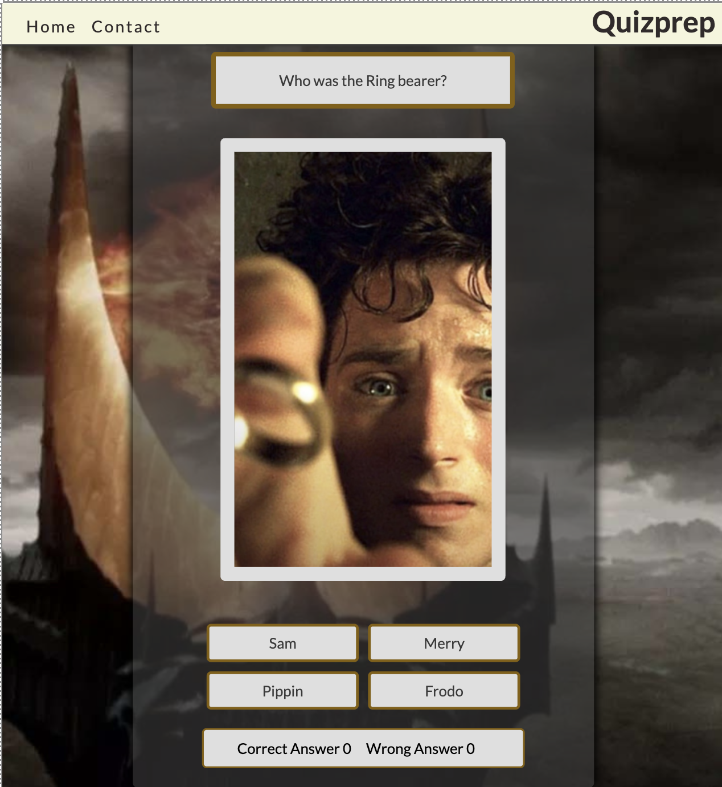
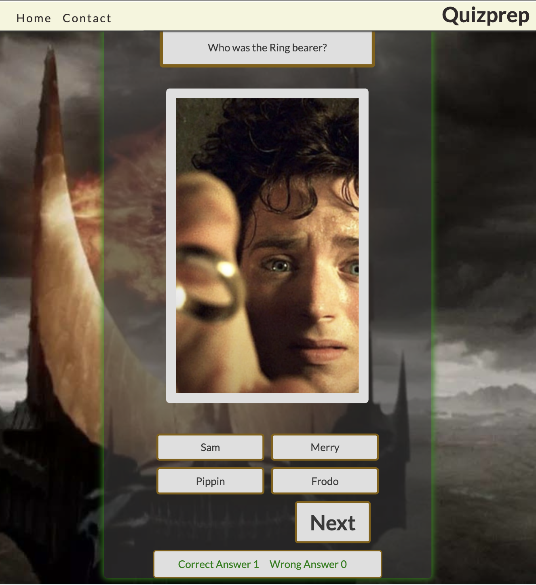

## Simple consistent layout
The layout is purposefully kept simple to tailor to users of mobile devices. Simple navigation and quick loading pages. The layout of the different quizpages is also the same to help users receive what they 'expect' when they would go through multiple quizzes. For future iterations new quiz formats could be considered. But the aim for this iteration is simplicity and giving an easy user experience.

## Footer with links to socials
Although Quizprep still has to create it's facebook, instagram, X (Twitter), Snapchat and Tiktok social media's, the footer has already been added with links to various social accounts. This will be updated when social media pages are created. These social media pages can in turn be used to make followers aware of new quizzes and to provide shareable links to Quizprep to expand the user base.

## Future features

### Quizprep Community
One of the biggest opportunities is creating a quiz community around Quizprep. Having people come back to the website, creating/suggesting quiz topics and rating them of others. The goal would be to create an interactive platform which users can use to find others with the same interests and excitement for quizzes. 

### Personal account / Log in
Saving data and performance in ones own personal account helps users be more involved with their scores. It can also be interesting to look back at ones own performance in different quizzes which can be tracked in the account.

### High score tracking (per quiz and overall)
When quizzes get larger and more engaging, it will be interesting to know how one does compare to themselves before, but also to others. tracking high scores and play time could create a form of competition, sparking desire to be quicker, better and of course play more quizzes.

### Rewards based on scoring
To help users get something in return for playing frequent quizzes (and to get them more engaged), rewards for high scores could be added. Especially when the range of quizzes increases, the gamification of it can spark additional joy for users but also for example accumulate points/credits to save up for products if Quizprep manages to receive page sponsors.

### Variations of quiz pages (quiz subject dependant)
There is currently one single format for quizzes. Depending on topics however, having different formats for quizzes could make the experience more interesting, but will also allow different type of quizzes to be added to the list (e.g. select locations on a map to showcase which captital of a country is which).

### advertisements/sponsoring (revenue creating)
- To make Quizprep financially viable, quizzes about specific products could be added as sponsored quizzes. Still fun, but also tailored to help users get more involved with specific products.
- Existing quizzes could also be sponsored by companies. Showcasing their brands/log's besides specific quizzes, potentially at specific times etc.

### Improved presentation options
Play Quizprep on the big screen! Currently the imaging is only set up for smaller to larger devices. However if Quizprep will be played with larger groups, image definitions, fonts and button sizes could be increased to cater to this.

### Recurring socials
Social media can play a large role in the 'selling' of Quizprep and keeping the user base up-to-date. For example adding new quizzes as teasers on instagram could bring frequent users back to Quizprep.

### Adding categories
When more and more quizzes are added, it will become beneficial to sort them into categories for a better overview and to help users only see quizzes that of subjects that they are interested in.

### Fun vs. Educational
Currently Fun is the 'aim of the game'. Quizzes can however be a very handy tool for educational purposes. Therefore adding educational quizzes can help users learn while still having fun.

### Adding context to the (right) answers
A large part of the fun when playing the quiz is to learn about the subject at hand. Whenever an answer is given, a short snippit can be added explaining the correct answer. This can be shown in both the cases whether an answer was correct or wrong.

# Testing
Testing of the various pages has been an ongoing process. Ensuring that mobile comes first has the benefit that overall the pages are tailored for it and will indeed look most streamlined on mobile. Through media queries the pages have been adapted to different screen sizes.

Testing has been performed on actual (Macbook 16 inch )laptops and phone screens (Samsung 8 & Samsung Galaxy S23).

[Am I responsive? view](https://ui.dev/amiresponsive?url=https://mjridder.github.io/QuizPrep/index.html)

## HTML validator test

Index page HTML validator pass 
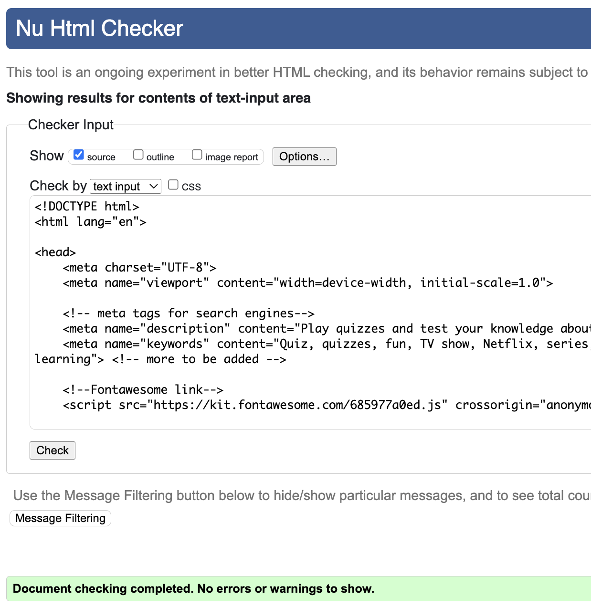

contact page HTML validator pass 
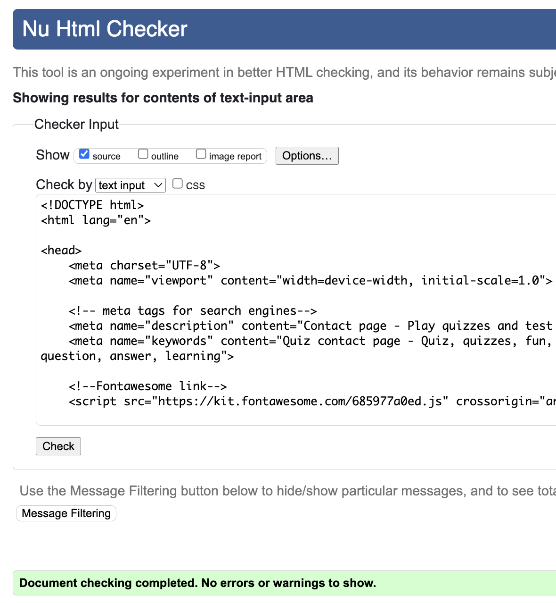

thank you page HTML validator pass 
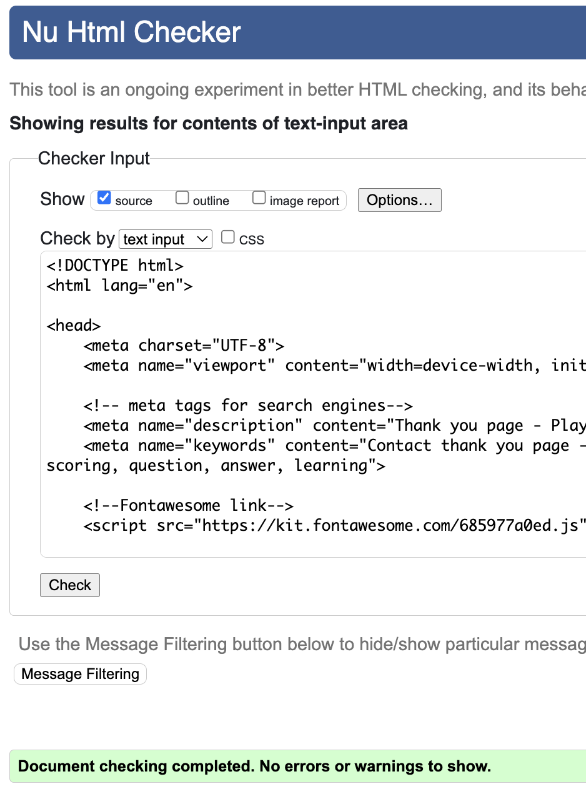

Witcher quiz page HTML validator pass 
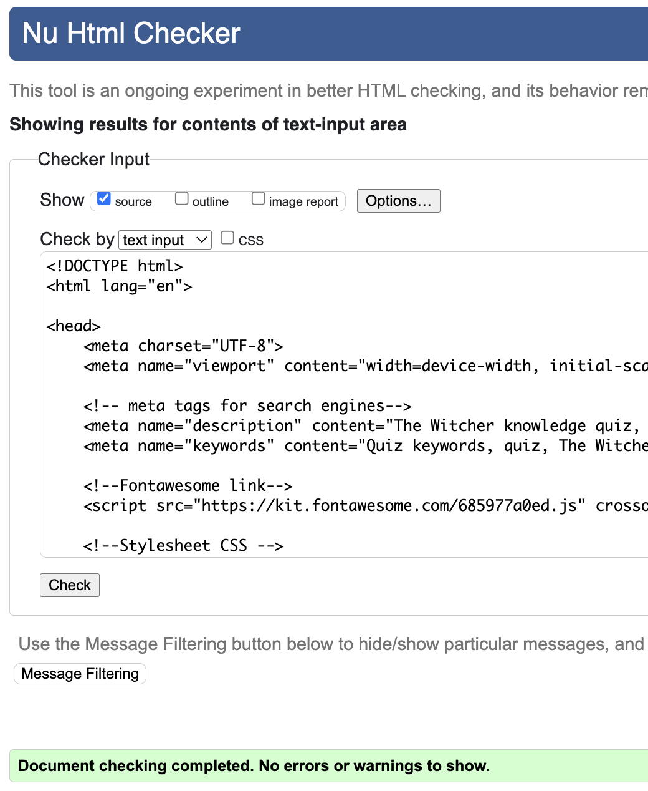

Lotr quiz page HTML validator pass 
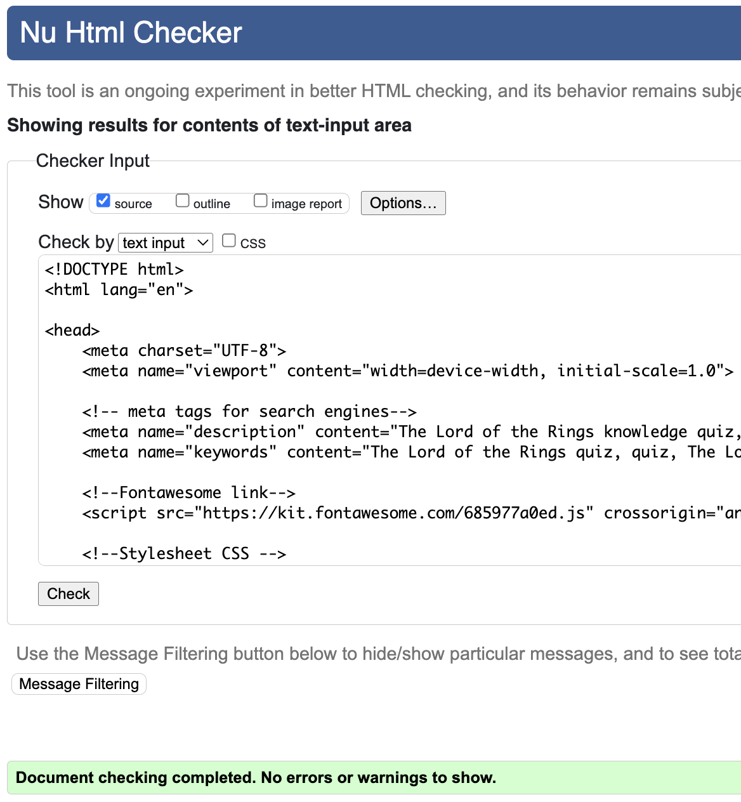

GoT quiz page HTML validator pass 
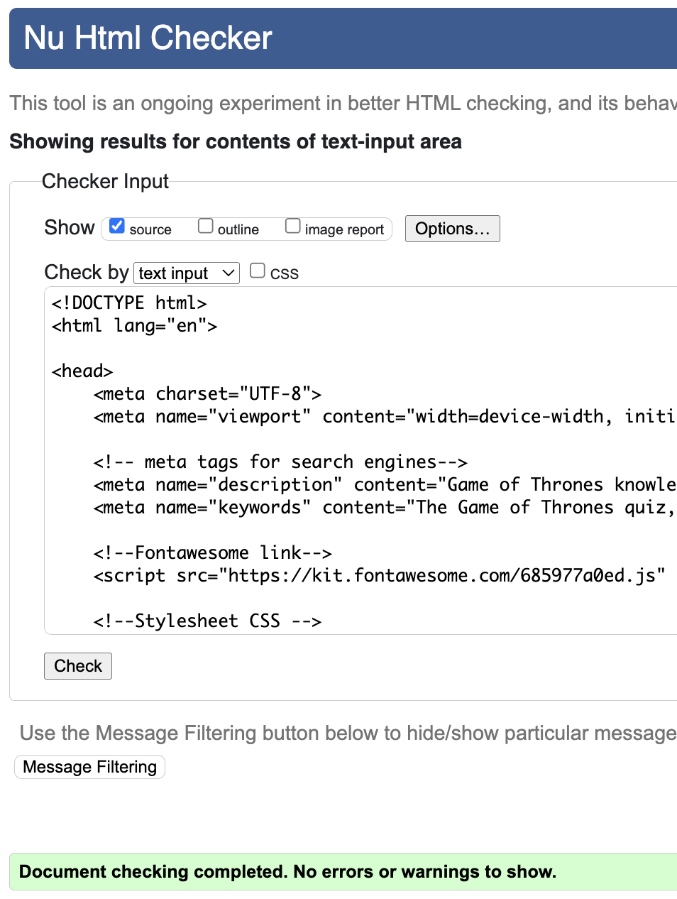

## CSS validator test

CSS page validator pass 
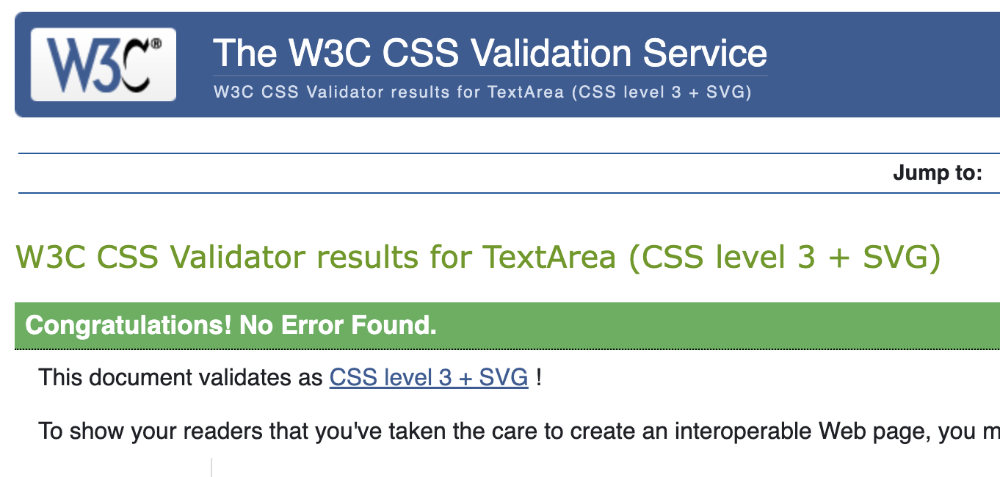

## (Un)fixed bugs

### Score counting (fixed)
For long the quiz did not have a unique action/function to restart the quiz. Restarting the quiz would not reset the values of scores under "incrementScore" and "incrementWrongAnswer". After trying different value adjusting objects (e.g. getting IDs and adjust via innerHTML or textContent) I managed to create a new function setScoreToZero that would be activated every time the 'Start' (or with that, the "Restart") button would be clicked. This as this is only used at the start or at the end of the quiz where the 0 score is desired.

### Answer buttons and scoring moves due to "Next" button (unfixed)
At the moment I have not been able to fix the moving positions of the different buttons in the grid. Because of that the scores (and somewhat the question and answers) move down everytime the 'Next' button appears. It is not a huge issue and some might actually think it to be fun or interesting. However for consistancy having these buttons set in place would provide a calmer experience for the user.

### Border radius of images (fixed)
At times I struggled with the images not being able to receive 'border-radius'. Or in many cases only partly. it was after a little digging I found out that this was due to image size. With that in mind I ensured to have different sizes of images so that they can be used properly on different screens and you would no longer see 'border-radius' only partly executed.

### CSS "not working" due to different levels on the page (fixed)
With the desire to have several transparent levels on the page (so that different styles could be applied to them), it at times over complicated the CSS formatting. By capping the amount of levels and by maintaining a set format for each page, I was able to work out which "level" impacted which part of the page. It is HTML/CSS basics, but if not actively looked for can take a lot of time to fix.

### Floating Footer
For a while, the footer did not remain at the bottom of the page, but would float halfway through the page, depending on screen size. I found that some of my CSS settings was working against each other. To fix this I applied the footer to the bottom of the page at all times.

## Deployment

The site was deployed to GitHub Pages. The steps to deploy are as follows:

- In the [GitHub repository](https://github.com/MJRidder/QuizPrep), navigate to the Settings tab
- From the source section drop-down menu, select the Main Branch, then click "Save".
- The page will be automatically refreshed with a detailed ribbon display to indicate the successful deployment.

The live link can be found [here](https://mjridder.github.io/QuizPrep/)

### Local Deployment
This project can be cloned or forked in order to make a local copy on your own system.

### Cloning
You can clone the repository by following these steps:

1. Go to the [GitHub repository](https://github.com/MJRidder/QuizPrep)
2. Locate the Code button above the list of files and click it
3. Select if you prefer to clone using HTTPS, SSH, or GitHub CLI and click the copy button to copy the URL to your clipboard
4. Open Git Bash or Terminal
5. Change the current working directory to the one where you want the cloned directory
6. In your IDE Terminal, type the following command to clone my repository:
- git clone https://github.com/MJRidder/QuizPrep
7. Press Enter to create your local clone.
Alternatively, if using Gitpod, you can click below to create your own workspace using this repository.

Please note that in order to directly open the project in Gitpod, you need to have the browser extension installed. A tutorial on how to do that can be found [here](https://www.gitpod.io/docs/configure/user-settings/browser-extension).

### Forking
By forking the GitHub Repository, we make a copy of the original repository on our GitHub account to view and/or make changes without affecting the original owner's repository. You can fork this repository by using the following steps:

1. Log in to GitHub and locate the [GitHub repository](https://github.com/MJRidder/QuizPrep)
2. At the top of the Repository (not top of page) just above the "Settings" Button on the menu, locate the "Fork" Button.
3. Once clicked, you should now have a copy of the original repository in your own GitHub account!

## Local VS Deployment
There are no differences between my local and deployed site currently.

# Credits

## Tools Used

| Source | Location | Notes |
| --- | --- | --- |
| [ILoveimg](https://www.iloveimg.com/) | quizpages | avif to webp reset |
| [Font Awesome](https://fontawesome.com/) | Across website | Inspiration for icons |
| [Balsamiq](https://Balsamiq.com/) | Wireframing | Creating original site design |
| [Github](https://github.com/j) | Site creation | Website building |
| [ChatGPT](https://openai.com/index/chatgpt/) | JS/CSS/HTML | Code review/adjustments |

## Resources Used

| Source | Location | Notes |
| --- | --- | --- |
| [W3schools](https://www.youtube.com/watch?v=riDzcEQbX6k) | Quizprep | HTML/CSS coding |
| [Web Dev Simplified](https://www.w3schools.com/) | JS | Quiz builder tutorial |
| [Shecodes](https://www.shecodes.io/) | Quizprep | JS coding |
| [Studytonight](https://www.studytonight.com/) | JS | Resetting values |
| [Stack Overflow](https://stackoverflow.com/) | Quizprep | HTML & CSS funcionality info |
| [Code Institute](https://learn.codeinstitute.net/ci_program/diplomainfullstacksoftwarecommoncurriculum) | Across website | HTML & CSS funcionality info |
| [ChatGPT](https://openai.com/chatgpt/) | JS | JS funcionality info |
| [Youtube](https://www.youtube.com/) | Across website | HTML, CSS and JS funcionality info |
| [Love running](https://mjridder.github.io/love-running/signup.html) | Across website | website inspiration |
| [Lovattpuzzles](https://lovattspuzzles.com/) | Quizprep | Inspriation |
| [Kahoot](https://kahoot.com/) | Quizprep | Inspriation |
| [W3schools](https://www.w3schools.com/) | Quizprep | Inspriation |
| [MerriamWebster](https://www.merriam-webster.com/games/spell-it) | Quizprep | Inspriation |
| [Personality Lab](https://test2.thepersonalitylab.org/mbv2) | Quizprep | Inspriation |
| [NSPCC](https://www.nspcc.org.uk/keeping-children-safe/online-safety/quiz/) | Quizprep | HTML/CSS coding |
| [Sporcle](https://www.sporcle.com/) | Quizprep | HTML/CSS coding |
| [W3schools](https://www.w3schools.com/) | Quizprep | HTML/CSS coding |
| [CI Love Running](https://mjridder.github.io/love-running/) | Quizprep | page formatting |
| [CI Love Maths](https://mjridder.github.io/love-maths/) | Quizprep | JS coding |
| [Medlineplus](https://medlineplus.gov/genetics/understanding/traits/handedness/) | Quizpage | % of righthanded vs. lefthanded users |

Special shout outs:
1. First to my mentor [Sheryl Goldberg](https://github.com/sherylg343) for supporting me in several sessions leading up to the completion of my P1 Portfolio project. I have learned a lot.
2. Secondly to Laurette van der Walt who has been so amazing to help me resize the desired images to the required heights and widths to be applicable for different sizes of screens and pages
3. A special shout out goes to the youtube channel: Web Dev Simplified, supporting my learnings with simplified Youtub tutorials. I have taken much learning from one of his [older videos](https://www.youtube.com/watch?v=riDzcEQbX6k), providing guidance on how to create a basic quiz. From there I have been able to expand on it by adding multiple quizzes, imaging, score tracking and window dressing for the quizzes to appeal to a larger audience.

## Content/Media Used

| Source | Location | Notes |
| --- | --- | --- |
| [Variety](https://variety.com/) | Quizpage | Images |
| [Future CDN](https://cdn.mos.cms.futurecdn.net/) | Quizpage | Images |
| [Flixter](https://resizing.flixster.com/) | Quizpage | Images |
| [Nymag](https://pyxis.nymag.com/) | Quizpage | Images |
| [Forbes](https://imageio.forbes.com/) | Quizpage | Images |
| [Watchmojo](https://www.watchmojo.com/) | Quizpage | Images |
| [Fandango](https://statcdn.fandango.com/) | Quizpage | Images |
| [Gamerant](https://static0.gamerantimages.com/) | Quizpage | Images |
| [CDN](https://lirp.cdn-website.com/) | Quizpage | Images |
| [Phantastic](https://www.thephantastic.com/) | Quizpage | Images |
| [Reddit](https://www.reddit.com/) | Quizpage | Images |
| [IGN](https://oyster.ignimgs.com/) | Quizpage | Images |
| [Brittanica](https://cdn.britannica.com/) | Quizpage | Images |
| [Vanity fair](https://media.vanityfair.com/) | Quizpage | Images |
| [Pexels](https://www.pexels.com/) | Quizpage | Images |

# Updates

| Feedback | Solution | Completed Y/N |
| --- | --- | --- |
| Use JS hint checker | Execute | Pending |
| One answer possibility | disable buttons | Y |
| Fix console log error when navigating between pages  | Unknown | Y |
| Refactor script to follow DRY principle | Execute | Y |
| Remove console log statements used for debugging | Execute | Y |
| Use `const` keyword for variables that won’t be reassigned | Execute | Y |
| compress images exceeding 1MB  | Execute | N |
| Use hyphens for files with multiple words | Execute | Y |
| Improve responsiveness across devices | Execute | Y |
| Write commit messages in the imperative mood | Execute | Y |
| Address JavaScript validation errors | Execute | N |
